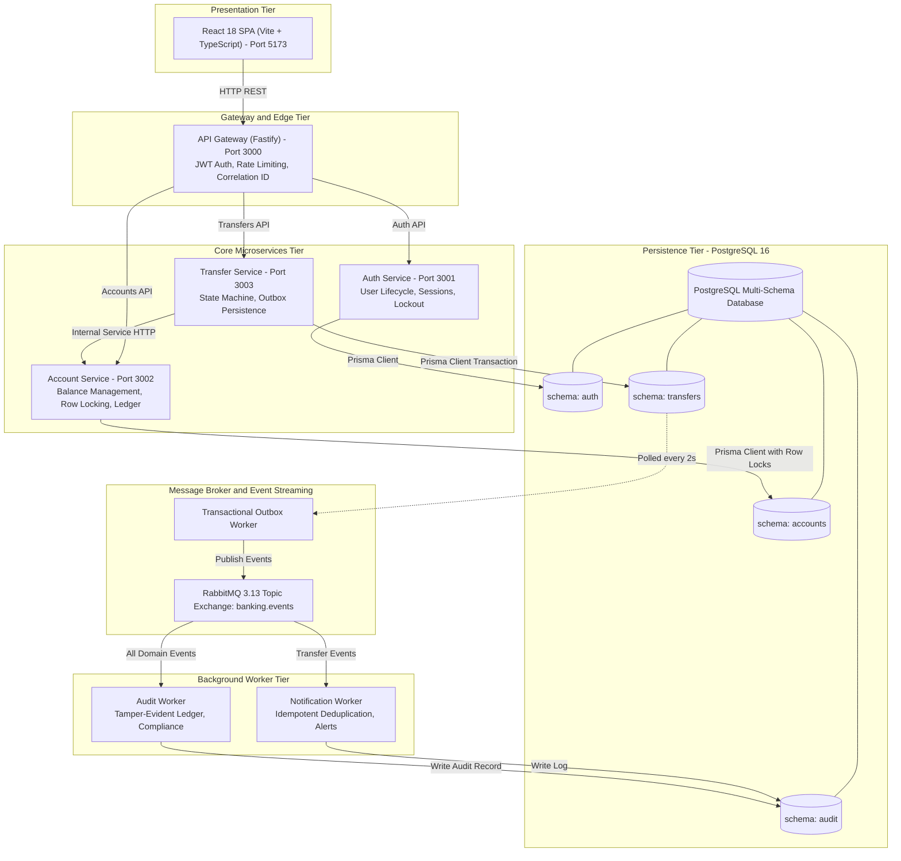
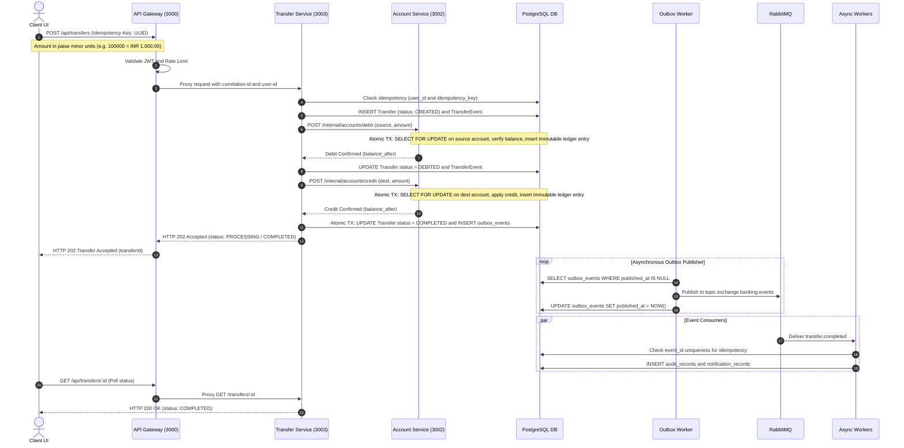
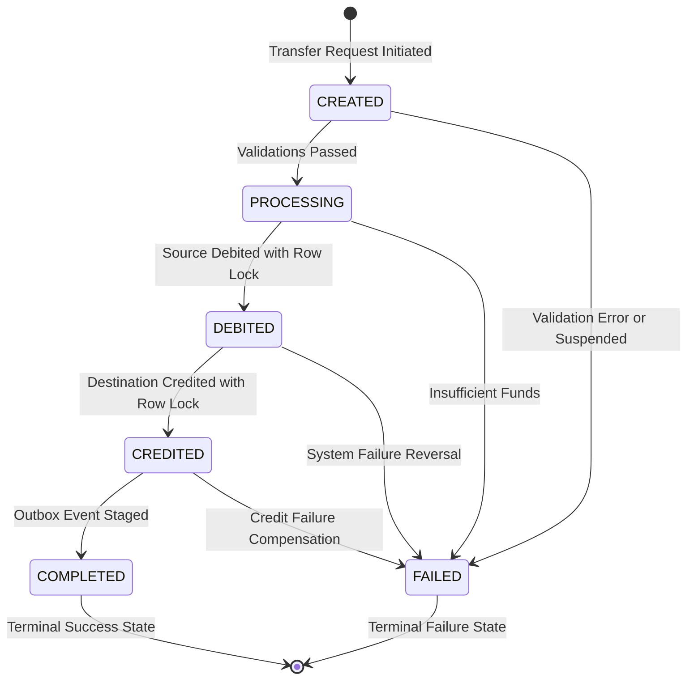

# 🏦 Enterprise Distributed Banking Platform

[](https://www.typescriptlang.org/)
[](https://nodejs.org/)
[](https://www.fastify.io/)
[](https://react.dev/)
[](https://vitejs.dev/)
[](https://www.postgresql.org/)
[](https://redis.io/)
[](https://www.rabbitmq.com/)
[](https://www.docker.com/)
[](https://www.prisma.io/)
[](https://vitest.dev/)
[](https://playwright.dev/)

---

## 📌 Executive Summary

The **Enterprise Distributed Banking Platform** is a production-grade, highly available financial services application designed to demonstrate mission-critical backend engineering, distributed consistency, and financial accounting guarantees. 

Built using an asynchronous **Microservices Architecture** on Node.js and TypeScript, the platform guarantees:
- **Strict Financial Correctness**: Double-entry ledger accounting, zero negative balance enforcement, and zero floating-point arithmetic (all monetary transactions stored as `BigInt` minor units in paise/cents).
- **ACID Transaction Isolation**: Row-level locking (`SELECT FOR UPDATE`) prevents race conditions, balance double-spending, and concurrency anomalies.
- **Reliable Event Sourcing & Delivery**: Implements the **Transactional Outbox Pattern** with RabbitMQ topic exchanges to achieve reliable, at-least-once asynchronous event delivery without distributed 2-Phase Commit (2PC) bottlenecks.
- **Finite State Machine Orchestration**: Strict forward-only state progression (`CREATED` → `PROCESSING` → `DEBITED` → `CREDITED` → `COMPLETED` / `FAILED`) recorded in an immutable audit event stream.
- **Defense-in-Depth Security**: JWT authentication with rotating refresh tokens, automated brute-force account lockouts, API rate-limiting, internal microservice signature validation, and sensitive data masking.

---

## 🏛️ System Architecture

### 1. High-Level Architecture



---

### 2. End-to-End Money Transfer Flow

The sequence diagram below demonstrates an asynchronous, idempotent fund transfer execution:



---

### 3. Transfer State Machine

Transfers follow a strict unidirectional state machine. Backward transitions or illegal jumps are rejected at both the domain model and database layer.



---

## 🛡️ Financial Safety & Ledger Invariants

The platform enforces 10 non-negotiable core invariants:

| # | Invariant | Technical Implementation |
|---|---|---|
| **1** | **No Negative Balance** | PostgreSQL database `CHECK (balance_minor >= 0)` constraint combined with `SELECT ... FOR UPDATE` row locks. |
| **2** | **Zero Floating Point Errors** | All money is represented in integer minor units (paise: ₹1.00 = 100 paise) using JavaScript `BigInt` and PostgreSQL `BIGINT`. |
| **3** | **No Duplicate Transfers** | Database unique constraint `UNIQUE (initiated_by_user_id, idempotency_key)` guarantees idempotent transfer submissions. |
| **4** | **Double-Entry Balancing** | Total debited from source account equals total credited to destination account ($Debit = Credit$) for every transfer. |
| **5** | **Immutable Ledger Entries** | Ledger rows are append-only. Updates and deletions are blocked by PostgreSQL database rules and ORM encapsulation. |
| **6** | **Race Condition Elimination** | Debit and credit operations acquire pessimistic row locks (`SELECT FOR UPDATE`) on the target account record before balance evaluation. |
| **7** | **Atomic Outbox Staging** | State transitions and domain event outbox entries are committed within the exact same database transaction (`BEGIN ... COMMIT`). |
| **8** | **Strict Ownership Enforcement** | Every read and write validates that the session `userId` matches the account or transfer owner. |
| **9** | **Idempotent Consumers** | Audit and Notification workers check `event_id` unique constraints before recording, safely handling RabbitMQ at-least-once replays. |
| **10** | **Single Terminal State** | Transfers in `COMPLETED` or `FAILED` states are immutable and cannot transition further. |

---

## 🗂️ Monorepo Directory Structure

The project is organized as an enterprise npm workspace monorepo:

```
Banking-platform/
├── apps/
│   ├── api-gateway/            # Fastify API Gateway (Auth, Proxy, Rate-Limit, CORS)
│   ├── auth-service/           # User lifecycle, bcrypt hashing, JWT & session management
│   ├── account-service/        # Account management, balance ledger, row-level locking
│   ├── transfer-service/       # Transfer coordinator, state machine, outbox worker
│   └── frontend/               # React 18 + TypeScript + Vite responsive dashboard
├── packages/
│   ├── contracts/              # Shared TypeScript interfaces, DTOs, and domain schemas
│   ├── errors/                 # Standardized Banking error hierarchy & HTTP mapping
│   ├── logger/                 # Production Pino logger with redaction & correlation IDs
│   └── prisma-client/          # Multi-schema Prisma ORM generation & migrations
├── workers/
│   ├── audit-worker/           # RabbitMQ consumer: stores tamper-evident audit records
│   └── notification-worker/    # RabbitMQ consumer: idempotent notification delivery
├── docker/
│   ├── Dockerfile.service      # Multi-stage Docker build for backend services
│   ├── Dockerfile.worker       # Multi-stage Docker build for async background workers
│   └── Dockerfile.migrate      # Automatic database migration runner container
├── docs/
│   ├── API.md                  # Complete REST API documentation & payload examples
│   ├── ARCHITECTURE.md         # Deep-dive architectural decisions & invariants
│   └── DEPLOYMENT.md           # Production deployment topologies & Fly.io / Vercel specs
├── prisma/
│   ├── schema.prisma           # Multi-schema PostgreSQL definitions
│   └── migrations/             # SQL schema migrations (auth, accounts, transfers, audit)
├── tests/
│   ├── unit/                   # State machine & financial invariant tests (Vitest)
│   ├── concurrency/            # Concurrent transfer & double-spending race tests
│   ├── api/                    # Microservice HTTP integration tests
│   ├── e2e/                    # End-to-end browser user journey tests (Playwright)
│   └── load/                   # High-throughput load & stress testing (k6)
├── .env.example                # Canonical environment variable specification
├── docker-compose.yml          # Full-stack local orchestration (infra + services + workers)
├── package.json                # Workspace configuration and unified scripts
└── tsconfig.base.json          # Shared strict TypeScript compiler configuration
```

---

## 🗄️ Multi-Schema Database Architecture

PostgreSQL is partitioned into four logical schemas to provide boundary isolation between bounded contexts while preserving atomic transactional capability:

```
PostgreSQL: banking_platform
├── auth
│   ├── users                   # id (UUID), email, password_hash, first_name, last_name, is_active
│   ├── sessions                # id, user_id, refresh_token (UNIQUE), expires_at, revoked_at
│   └── login_attempts          # id, user_id, success (BOOLEAN), ip_address, created_at
│
├── accounts
│   ├── accounts                # id, user_id, account_number (UNIQUE), balance_minor (BIGINT), status
│   └── ledger_entries          # id, account_id, entry_type (DEBIT|CREDIT), amount_minor, balance_after (IMMUTABLE)
│
├── transfers
│   ├── transfers               # id, source_account_id, dest_account_id, amount_minor, status, idempotency_key
│   ├── transfer_events         # id, transfer_id, from_status, to_status, metadata (IMMUTABLE LOG)
│   └── outbox_events           # id, event_type, aggregate_id, correlation_id, payload, published_at
│
└── audit
    ├── audit_records           # id, event_id (UNIQUE), event_type, aggregate_id, payload, processed_at
    └── notification_records    # id, event_id (UNIQUE), recipient_id, message, delivered_at
```

---

## 🔌 Service Port & Infrastructure Matrix

| Service / Container | Port | Type | Responsibilities |
|---|---|---|---|
| **Frontend** | `5173` | Web UI | React + Vite UI (Dashboard, Transfers, Ledger History) |
| **API Gateway** | `3000` | HTTP / REST | Request routing, JWT validation, rate limiting, correlation ID |
| **Auth Service** | `3001` | HTTP / REST | Registration, login, token refresh, account lockout |
| **Account Service** | `3002` | HTTP / REST | Balance queries, atomic debit/credit operations, ledger generation |
| **Transfer Service** | `3003` | HTTP / REST | Transfer state machine, transactional outbox worker, orchestration |
| **Notification Worker** | *Internal* | AMQP Consumer | Consumes `banking.events`, processes user notifications idempotently |
| **Audit Worker** | *Internal* | AMQP Consumer | Consumes `banking.events`, persists immutable compliance log |
| **PostgreSQL 16** | `5432` | Relational DB | Multi-schema persistence (`auth`, `accounts`, `transfers`, `audit`) |
| **Redis 7** | `6379` | In-Memory Store | Session caching and API rate limiting |
| **RabbitMQ 3.13** | `5672` / `15672` | Message Broker | Topic exchange messaging (Management UI on port 15672) |

---

## 🚀 Quick Start Guide

### Prerequisites
- [Node.js](https://nodejs.org/) `>= 20.0.0`
- [npm](https://www.npmjs.com/) `>= 10.0.0`
- [Docker](https://www.docker.com/) & Docker Compose

---

### Option 1: Full-Stack Docker Deployment (Recommended)

Start the entire distributed ecosystem (PostgreSQL, Redis, RabbitMQ, DB Migrations, 4 Backend Services, and 2 Background Workers) with a single command:

```bash
# 1. Clone the repository
git clone https://github.com/v-i-s-h-a-l-l/Banking-Application.git
cd Banking-Application

# 2. Copy the environment configuration
cp .env.example .env

# 3. Spin up all containers
docker-compose up --build
```

Launch the frontend client in a separate terminal:
```bash
cd apps/frontend
npm install
npm run dev
```

Open your browser:
- **Banking UI**: [http://localhost:5173](http://localhost:5173)
- **API Gateway**: [http://localhost:3000](http://localhost:3000)
- **RabbitMQ Dashboard**: [http://localhost:15672](http://localhost:15672) *(Credentials: `banking` / `banking_secret`)*

---

### Option 2: Local Development Setup

To run services natively on host machines with external Docker infrastructure:

```bash
# 1. Install root & workspace dependencies
npm install

# 2. Start backing services only (PostgreSQL, Redis, RabbitMQ)
docker-compose up -d postgres redis rabbitmq

# 3. Generate Prisma client & execute migrations
npm run db:generate
npm run db:migrate

# 4. Build shared workspace packages
npm run build:packages

# 5. Build all services & applications
npm run build
```

---

## 🧪 Comprehensive Testing Suite

The platform includes a test suite spanning all testing quadrants:

```bash
# Run unit tests (State Machine & Financial Invariants)
npm run test:unit

# Run API & microservice integration tests
npm run test:api

# Run high-concurrency race condition tests
npm run test:concurrent

# Run end-to-end user journey tests (Playwright)
npm run test:e2e

# Run all test suites
npm run test:all

# Type-check all workspace packages
npm run typecheck

# Lint workspace packages
npm run lint
```

### High-Throughput Load Testing (k6)
Stress-test the transfer engine and transactional outbox:
```bash
k6 run tests/load/transfer.js
```

---

## 📡 REST API Quick Reference

### 🔐 Authentication (`/api/auth`)

#### `POST /auth/register`
Create a new user account.
```json
{
  "email": "user@example.com",
  "password": "SecurePassword123!",
  "firstName": "Jane",
  "lastName": "Doe"
}
```

#### `POST /auth/login`
Authenticate and obtain JWT access & refresh tokens.
```json
{
  "email": "user@example.com",
  "password": "SecurePassword123!"
}
```

---

### 💳 Account Management (`/api/accounts`)
*Requires `Authorization: Bearer <token>`*

#### `POST /accounts`
Open an account (`SAVINGS` or `CURRENT`).
```json
{
  "accountType": "SAVINGS"
}
```

#### `GET /accounts`
Retrieve all accounts owned by the authenticated user.

#### `GET /accounts/:id/ledger?page=1&limit=20`
Fetch immutable audit ledger statements with running balance history.

---

### 💸 Fund Transfers (`/api/transfers`)
*Requires `Authorization: Bearer <token>` & `Idempotency-Key: <UUID>`*

#### `POST /transfers`
Initiate an atomic fund transfer.
```json
{
  "sourceAccountId": "d3b07384-d113-4905-95e2-04e8ee3a44d1",
  "destinationAccountId": "e4c18495-e224-5016-06f3-15f9ff4b55e2",
  "amount": 50000,
  "description": "Invoice Settlement #1042"
}
```
> **Note:** `amount` is expressed in integer minor units (paise). `50000` = ₹500.00.

#### `GET /transfers/:id`
Query the real-time status of a transfer.
```json
{
  "success": true,
  "data": {
    "transfer": {
      "id": "a1b2c3d4-0000-0000-0000-123456789abc",
      "status": "COMPLETED",
      "amountMinor": "50000",
      "currency": "INR",
      "completedAt": "2026-10-03T10:00:00.000Z",
      "failureReason": null
    }
  }
}
```

---

### 🚨 Standardized Error Envelope

All microservices emit errors according to an RFC-compliant structure:

```json
{
  "success": false,
  "error": {
    "code": "INSUFFICIENT_FUNDS",
    "message": "Account balance insufficient for this debit operation.",
    "details": null
  },
  "meta": {
    "requestId": "90d1f731-001a-4d2c-8067-1725b81a7ee5",
    "correlationId": "f784e031-15b2-4d2c-bf72-3511b81a8cc2",
    "timestamp": "2026-10-03T10:00:00.000Z"
  }
}
```

---

## ⚡ Resiliency & Fault Injection

The platform includes built-in hooks for testing resiliency in distributed failure modes:

| Variable | Target | Simulation Behavior |
|---|---|---|
| `FAIL_ACCOUNT_SERVICE=true` | Account Service | Simulates downstream service failure during debit/credit |
| `FAIL_TRANSFER_SERVICE=true` | Transfer Service | Tests circuit breaker & client timeout handling |
| `FAIL_RABBITMQ=true` | Broker Connection | Validates that transactional outbox queues events safely without loss |
| `ARTIFICIAL_LATENCY_MS=500` | Gateway & Services | Simulates network partitions, lag, and database connection queueing |

---

## 📜 License

This project is licensed under the MIT License — see the [LICENSE](LICENSE) file for details.
